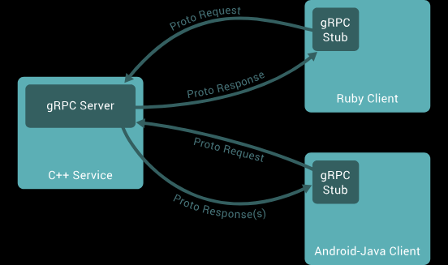
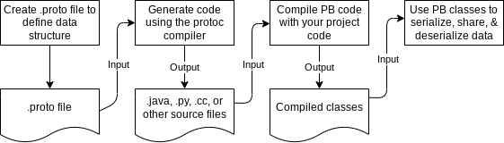
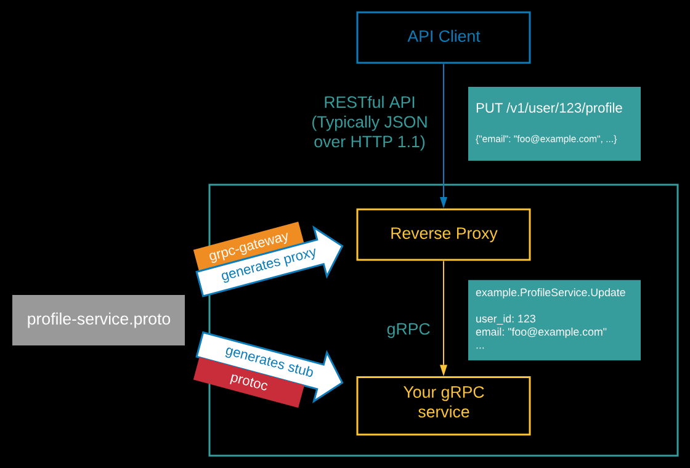

# gRPC + Protobuf + gRPC-gateway学习项目
本项目主要用于gRPC + Protobuf + gRPC-gateway的学习，以及HTTP/1.x请求转发到gRPC服务的验证。

## gRPC
The gRPC framework provides a high-performance, open-source framework for building and consuming network services. It’s a framework that’s developed by Google and used by many of its products.


## Protobuf
Protocol Buffers (a.k.a., protobuf) are Google's language-neutral, platform-neutral, extensible mechanism for serializing structured data. You can learn more about it in protobuf's documentation.


## gRPC-gateway
The gRPC-Gateway is a plugin of the Google protocol buffers compiler protoc. It reads protobuf service definitions and generates a reverse-proxy server which translates a RESTful HTTP API into gRPC. This server is generated according to the google.api.http annotations in your service definitions.

This helps you provide your APIs in both gRPC and RESTful style at the same time.


### Docs:
https://grpc-ecosystem.github.io/grpc-gateway/

## 目录说明
```text
grpc-gateway  -- grpc网关，负责将HTTP/1.x请求转发到grpc服务端
  -- example
    -- grpc
      -- proto  -- 生成的Go语言的代码
grpc-java  -- grpc java语言示例
  -- src
    -- main
      -- java
        -- org
          -- example
            -- grpc
              -- proto  -- 生成的Java语言的代码
grpc-python  -- grpc python语言示例
  -- example
    -- grpc
      -- proto  -- 生成的python语言的代码
proto-files  -- proto文件
protoc -- protoc工具, 用于读取proto文件生成代码，请配置到环境变量中
google.zip  -- google官方的proto文件
```

## Protoc工具
```bash
# 代码生成工具及下载路径
protoc.exe
 - https://github.com/protocolbuffers/protobuf/releases

protoc-gen-go.exe
 - https://github.com/protocolbuffers/protobuf-go/releases

protoc-gen-go-grpc.exe
 - https://github.com/grpc/grpc-go/releases

protoc-gen-grpc-gateway.exe, protoc-gen-openapiv2.exe
 - https://github.com/grpc-ecosystem/grpc-gateway/releases/

protoc-gen-js.exe
 - https://github.com/protocolbuffers/protobuf-javascript/releases

protoc-gen-grpc-web.exe
 - https://github.com/grpc/grpc-web/releases
```

## 代码生成
```bash
# go语言 windows环境
cd .\proto-files\
protoc -I . --go_out ../grpc-gateway/example/grpc/proto --go_opt paths=source_relative --go-grpc_out ../grpc-gateway/example/grpc/proto --go-grpc_opt paths=source_relative --grpc-gateway_out ../grpc-gateway/example/grpc/proto --grpc-gateway_opt logtostderr=true,paths=source_relative ./*.proto

# java语言 windows环境
mvn protobuf:compile
mvn protobuf:compile-custom

# python语言 windows环境
cd .\proto-files\
python -m grpc_tools.protoc -I ./ --python_out=../grpc-python/example/grpc/proto --grpc_python_out=../grpc-python/example/grpc/proto ./*.proto

```
